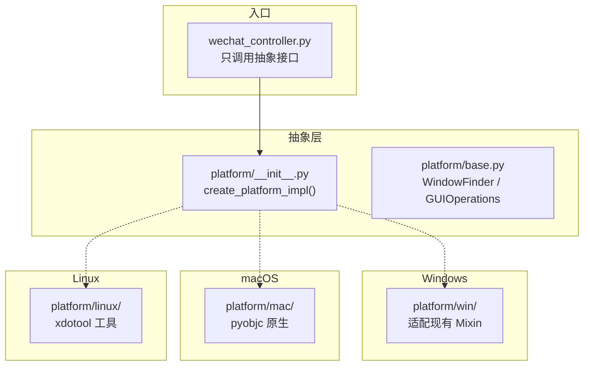

# WeChat SendMsg - 代码库指南

本文档为 AI 编码代理提供有关此代码库的关键信息。

## 使用中文
- 所有文档、注释和字符串均使用中文
- LLM 输出也应使用中文
- 代码注释、docstring、日志信息必须使用中文

## 项目概述

这是一个 HTTP API 驱动的微信消息发送工具，支持 MCP (Model Context Protocol) 协议集成，专为 AI 助手和自动化任务设计。支持 **Windows / macOS / Linux** 三平台。

**核心技术栈:**
- Python 3.10+
- 官方 MCP Python SDK (FastMCP) + Starlette
- MCP 协议 (2024-11-05)
- **跨平台抽象层** (src/platform/)
- **Windows**: pyautogui + win32gui + win32clipboard
- **macOS**: pyautogui + pyobjc (NSWorkspace + NSPasteboard)
- **Linux**: pyautogui + xdotool + xclip
- 全平台: Uvicorn ASGI 服务器

**主要功能模块:**
- MCP 服务器 + HTTP API (src/mcp_server.py) — FastMCP + Starlette 统一应用
- 消息队列 + 后台 Worker (src/message_queue.py) — SQLite 持久化，优先级，重试，崩溃恢复
- 微信控制器 (src/wechat_controller.py) — 跨平台入口，组合平台抽象层
- **平台抽象层** (src/platform/) — 三平台统一接口
  - `base.py` — 抽象基类 (WindowFinder / GUIOperations)
  - `clipboard.py` — 跨平台剪贴板代理
  - `win/` — Windows 实现（适配现有 Mixin 代码）
  - `mac/` — macOS 实现（NSWorkspace + NSPasteboard）
  - `linux/` — Linux 实现（xdotool + xclip）
- 窗口查找 Mixin (src/window_finder.py) — Windows 原有
- 系统托盘管理 Mixin (src/tray_manager.py) — Windows 原有
- GUI 操作 Mixin (src/gui_operations.py) — Windows 原有
- 配置管理 (src/config.py)
- 路径工具 (src/paths.py) — 兼容源码模式和 Nuitka 编译模式
- 系统托盘应用 (src/systray_app.py) — pystray 托盘图标 + 后台 uvicorn
- 防封号保护系统 (src/anti_ban/)

## 项目结构

```
wechat-sendmsg/
├── src/
│   ├── __init__.py               # 包初始化
│   ├── mcp_server.py             # MCP 服务器 + HTTP API（FastMCP + Starlette 统一应用）
│   ├── wechat_controller.py      # 跨平台微信控制器（组合平台抽象层）
│   ├── window_finder.py          # [Windows] WindowFinderMixin
│   ├── tray_manager.py           # [Windows] TrayManagerMixin
│   ├── gui_operations.py         # [Windows] GUIOperationsMixin
│   ├── platform/                 # 🌟 跨平台抽象层（核心）
│   │   ├── __init__.py           # 工厂函数，按 sys.platform 分派
│   │   ├── base.py               # 抽象基类接口
│   │   ├── clipboard.py          # 跨平台剪贴板代理
│   │   ├── win/                  # Windows 实现（适配器模式）
│   │   │   ├── __init__.py
│   │   │   ├── window_finder.py  # 适配 WindowFinderMixin
│   │   │   └── gui_ops.py        # 适配 GUIOperationsMixin + WinClipboard
│   │   ├── mac/                  # macOS 实现（pyobjc）
│   │   │   ├── __init__.py
│   │   │   ├── window_finder.py  # NSWorkspace + ScriptingBridge
│   │   │   └── gui_ops.py        # NSPasteboard + pyautogui
│   │   └── linux/                # Linux 实现（xdotool）
│   │       ├── __init__.py
│   │       ├── window_finder.py  # xdotool / wmctrl
│   │       └── gui_ops.py        # xclip + pyautogui
│   ├── config.py                 # 配置管理模块
│   ├── message_queue.py          # MessageQueue + QueueWorker
│   ├── paths.py                  # 路径工具模块
│   ├── systray_app.py            # 系统托盘应用模块
│   └── anti_ban/                 # 防封号保护系统
├── examples/
│   └── mcp_client_example.py     # MCP 客户端示例
├── docs/
│   ├── QUICK_START.md            # 快速开始指南
│   ├── CROSS_PLATFORM_GUIDE.md   # 跨平台使用指南
│   ├── AVOID_BAN.md              # 防封号指南
│   └── ...
├── static/                       # Web 静态文件
├── data/                         # 配置文件 + 消息队列数据库
├── requirements.txt              # Python 依赖（含平台标记）
├── AGENTS.md                     # 本文档
└── README.md                     # 项目说明
```

## 构建/测试命令

### 安装依赖

```bash
pip install -r requirements.txt
```

依赖按平台自动选择：
- Windows: `pywin32`
- macOS: `pyobjc-core`, `pyobjc-framework-Cocoa`, `pyobjc-framework-Quartz`
- Linux: `pyperclip`（系统需额外安装 `xdotool`, `wmctrl`, `xclip`）

### 运行测试

**检查语法：**
```bash
python -m py_compile src/platform/*.py src/platform/*/ *.py
```

**测试状态（无需实际发送）：**
```bash
# macOS
python -c "import sys; sys.path.insert(0, 'src'); from platform import create_platform_impl; f, g, c = create_platform_impl(); print(f.get_status())"
```

### 运行服务器

**启动 MCP 服务器 (stdio 模式，默认):**
```bash
python src/mcp_server.py
```

**启动统一服务器 (streamable-http 模式):**
```bash
python src/mcp_server.py --transport streamable-http --port 8765
```

**Windows 系统托盘模式：**
```bash
python src/mcp_server.py --transport streamable-http --systray
```

**手动测试客户端:**
```bash
cd examples
python mcp_client_example.py                              # stdio 模式
python mcp_client_example.py --transport streamable-http \
  --url http://localhost:8765/mcp                         # HTTP 模式
```

**Linux xdotool 测试：**
```bash
# 检查微信窗口能否被 xdotool 找到
xdotool search --name "微信"
xdotool search --name "WeChat"
xdotool search --class "微信"

# 检查 xclip 是否可用
echo "test" | xclip -selection c
xclip -selection c -o
```

## 代码风格指南

### 通用原则

1. **编码风格**: 严格遵循 PEP 8 Python 编码规范
2. **字符编码**: 所有文件使用 UTF-8 编码
3. **行长度**: 建议不超过 120 字符
4. **缩进**: 使用 4 个空格 (不使用 Tab)
5. **空行**: 类定义间 2 个空行，方法定义间 1 个空行
6. **文件头**: 每个文件开头必须有模块 docstring 说明文件功能

### 文件头模板

```python
#!/usr/bin/env python3
"""
模块名称
简要描述模块功能和用途。
"""
```

### 导入规范

**导入顺序 (PEP 8):**
```python
#!/usr/bin/env python3
"""模块 docstring"""

# 1. 标准库导入（按字母顺序）
import asyncio
import logging
import sys
import time
from typing import Any, Dict, Optional

# 2. 第三方库导入（按字母顺序）
import pyautogui

# 3. 本地应用/库导入（按字母顺序）
from .base import WindowFinder
```

**跨平台导入注意事项：**
- 平台特有的导入（`win32gui`、`pyobjc` 等）放在具体平台的子模块中
- 抽象层模块 (`base.py`, `__init__.py`) 不导入任何平台特有库
- 平台特有库使用懒加载（在方法内部 import）避免导入时报错

### 命名约定

**类名**: PascalCase
```python
class WindowFinder:       # 抽象基类
class MacWindowFinder:    # 平台实现
class WinClipboard:       # 剪贴板实现
class WeChatController:   # 控制器
```

**模块命名规则（平台子目录）：**
```
platform/win/    →  Win 前缀  (WinWindowFinder, WinGUIOperations, WinClipboard)
platform/mac/   →  Mac 前缀  (MacWindowFinder, MacGUIOperations, MacClipboard)
platform/linux/ →  Linux 前缀 (LinuxWindowFinder, LinuxGUIOperations, LinuxClipboard)
```

**函数/方法名**: snake_case
```python
def send_text_message():
def create_platform_impl():
def detect_wechat_version():
```

**常量名**: UPPER_SNAKE_CASE
```python
WECHAT_APP_NAMES = ['微信', 'WeChat']  # macOS/Linux 窗口名列表
```

**私有成员**: 单下划线前缀
```python
self._config = config
self._last_pid: Optional[int] = None
```

### 类型注解

**必须使用类型注解:**
```python
def send_text_message(self, contact_name: str, message: str) -> Dict[str, Any]:
def find_wechat_window(self) -> Optional[int]:
def create_platform_impl(config: object = None) -> Tuple[object, object, object]:
```

### 文档字符串

**使用中文文档字符串 (与项目保持一致):**
```python
def send_text_message(self, contact_name: str, message: str) -> Dict[str, Any]:
    """向指定联系人发送文本消息。"""
    pass

class MacWindowFinder(WindowFinder):
    """macOS 平台的微信窗口查找与激活。"""
    pass
```

### 错误处理

```python
try:
    result = await self._controller.send_text_message(contact_name, message)
except Exception as e:
    logger.error(f"发送消息失败: {e}")
    return {"ok": False, "reason": str(e)}
```

### 日志记录

```python
import logging
logger = logging.getLogger(__name__)

logger.debug("调试信息")
logger.info(f"找到微信进程: pid={pid}")
logger.warning("微信未运行")
logger.error(f"操作失败: {e}")
```

### 异步编程

```python
async def send_text_message(self, contact_name: str, message: str) -> Dict[str, Any]:
    """异步发送消息。"""
    return self.send_text_message_sync(contact_name, message)
```

## 跨平台架构指南

### 架构设计原则



### 添加新平台的步骤

1. 在 `src/platform/` 下创建 `<平台名>/` 目录
2. 实现 `WindowFinder` 和 `GUIOperations` 接口
3. 在 `<平台名>/gui_ops.py` 中实现 `*Clipboard` 类
4. 创建 `<平台名>/__init__.py` 导出 `create_impl()` 工厂函数
5. 在 `src/platform/__init__.py` 的 `create_platform_impl()` 中添加分支判断
6. 在 `requirements.txt` 中添加条件依赖

### 三平台对照表

| 维度 | Windows | macOS | Linux |
|------|---------|-------|-------|
| 窗口查找 | `win32gui.EnumWindows` | `NSWorkspace.runningApplications` | `xdotool search` |
| 窗口激活 | `SetForegroundWindow` | `SBApplication.activateWithOptions_` | `xdotool windowactivate` |
| 窗口恢复 | ShowWindow + 托盘双击 | Dock 激活 | `xdotool windowmap` |
| 剪贴板 | `win32clipboard` | `NSPasteboard` | `xclip` 命令行 |
| 搜索快捷键 | `Ctrl+F` | `Cmd+F` | `Ctrl+F` |
| 发送快捷键 | `Alt+S` → `Enter` | `Cmd+Enter` | `Alt+S` → `Enter` |
| 系统托盘 | pystray (Win32) | pystray (Dock) | pystray (AppIndicator) |
| 微信版本检测 | `GetFileVersionInfo` | `NSBundle info.plist` | `/proc/PID/cmdline` / `dpkg` |

### 跨平台实现注意事项

1. **不要**在抽象层 (`base.py`, `clipboard.py`, `__init__.py`) 导入任何平台特有库
2. **不要**修改已有的 Windows 代码 (`window_finder.py`, `gui_operations.py`, `tray_manager.py`)
3. 平台特有导入使用懒加载（在方法内部 `import`）
4. 剪贴板操作统一通过 `platform.clipboard.Clipboard` 代理类
5. `requirements.txt` 使用 `sys_platform` 环境标记区分平台依赖

## 微信自动化要点

1. **跨平台**：Windows/macOS/Linux 均支持
2. **使用剪贴板输入**避免输入法状态问题
3. **窗口焦点验证**：操作前必须确认窗口获得焦点
4. **剪贴板保护**：自动备份和恢复用户剪贴板内容
5. **仅支持 4.0+**：Windows 上低于 4.0 的版本会被跳过

## 注意事项

1. **macOS**: 需要 pyobjc 框架（通过 pip 自动安装）
2. **Linux**: 需要 xdotool / wmctrl / xclip 系统工具
3. **Windows**: 需要 pywin32（通过 pip 自动安装）
4. **运行要求**: 微信必须在运行并已登录
5. **窗口要求**: 微信窗口必须可见或最小化（支持自动恢复）
6. **异步优先**: 所有 I/O 操作使用 async/await

## 许可证

MIT License - 允许商业使用但需评估风险
