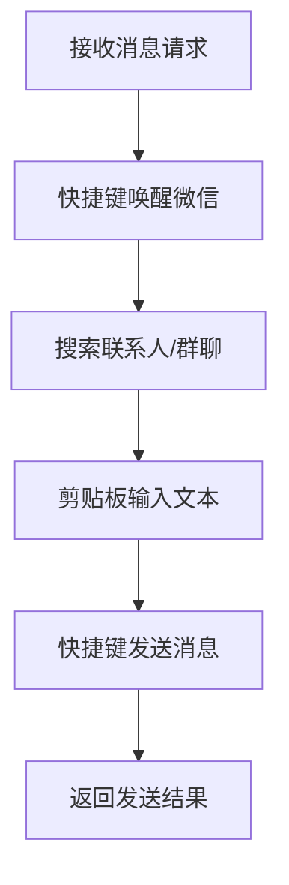

# WeChat MCP Server

<div align="center">


**让AI助手帮你发微信消息的小工具，简单安全易用**

[快速开始](#-安装和配置) • [功能特点](#-功能特点) • [使用方法](#-使用方法) • [API文档](#️-可用工具) • [常见问题](#-故障排除)

</div>

---

## 📋 目录

- [这是什么？](#-这是什么)
- [能做什么？](#-能做什么)
- [怎么安装？](#-安装和配置)
- [怎么使用？](#-使用方法)
- [有哪些功能？](#️-可用工具)
- [常见问题](#-故障排除)
- [注意事项](#️-注意事项)
- [支持我们](#-支持我们)
- [免责声明](#️-重要免责声明)
- [技术文档](#-技术文档)

---

## 🤔 这是什么？

这是一个**让AI助手帮你发微信消息**的小工具！

### 🎯 简单来说：
- 🤖 **AI助手的好帮手**：让Claude、ChatGPT等AI助手能直接发微信消息
- 🔌 **即插即用**：像USB一样简单连接AI和微信
- 💻 **纯模拟操作**：就像你亲手操作一样，只是让电脑帮你点鼠标按键盘

### 💡 为什么要用这个？
- 🕒 **节省时间**：不用手动复制粘贴消息
- 🤝 **自动化工作**：定时发送、批量处理都交给AI
- 🎮 **智能助手**：让AI帮你处理微信沟通

## 🎯 核心实现原理

### 纯GUI自动化方案
本项目采用**全程模拟键盘快捷键和鼠标操作**的方式实现微信消息发送，**绝无任何逆向工程或侵害行为**：



### 技术实现要点
1. **快捷键唤醒** - 使用全局快捷键（如 `Ctrl+Alt+W`）激活微信窗口
2. **剪贴板输入** - 使用Windows剪贴板API输入文本，避免输入法干扰
3. **快捷键发送** - 模拟键盘快捷键（Enter/Ctrl+Enter/Alt+S）发送消息

### 重要声明
- **无逆向工程**：本项目不涉及微信客户端逆向、内存读取、协议分析等行为
- **无数据窃取**：不读取微信聊天记录、联系人信息等任何用户数据
- **无协议破解**：不分析或破解微信通信协议
- **纯GUI操作**：所有操作均在用户界面层面完成，与人工操作完全一致

### 安全性保障
- **用户隐私保护**：所有操作均在本地完成，消息内容不经过任何第三方服务器
- **剪贴板保护**：自动备份和恢复用户原始剪贴板内容
- **权限最小化**：不请求网络或文件系统权限

------

## 💻 兼容性

- ✅ **微信版本** - 支持微信 4.0 以上版本
- ✅ **操作系统** - Windows 10/11 系统
- ✅ **AI助手** - 支持 Claude、ChatGPT 等AI助手

## ✨ 能做什么？

### 🎉 核心功能
- 📤 **发消息**：给微信好友或群聊发消息
- ⏰ **定时发送**：设置时间自动发送
- 📊 **消息队列**：排队发送，不怕消息太多
- 🔄 **自动重试**：发送失败会自动重试

### 🛡️ 安全保护
- 🚫 **绝不偷数据**：不读取你的聊天记录
- 🔒 **本地运行**：所有操作都在你电脑上完成
- ⚡ **模拟操作**：就像你自己操作微信一样

### 🎯 智能功能
- 🤖 **AI集成**：直接让AI助手帮你发消息
- 🌐 **网页管理**：浏览器里查看发送状态
- 📱 **后台运行**：最小化到系统托盘不打扰

## 🚀 安装和配置

### 1️⃣ 安装依赖
```bash
pip install -r requirements.txt
```

### 2️⃣ 确保微信已启动并登录
- 打开微信并登录你的账号
- 建议先向"文件传输助手"测试发送

## 🛠️ 可用工具

### 📤 发送微信消息
- **给谁发**：好友名字或群聊名称
- **发什么**：要发送的消息内容
- **怎么发**：立即发送或排队发送

### ⏰ 定时发送消息
- **设置时间**：延迟多少秒后发送
- **自动排队**：时间到了自动发送

### 📊 查看发送状态
- **查看队列**：有哪些消息在排队
- **查看详情**：每条消息的发送状态
- **管理消息**：取消或重试发送

## 💡 使用方法

### 🤖 在AI助手中使用
1. 配置AI助手连接本工具
2. 告诉AI助手："给张三发消息说你好"
3. AI助手会自动帮你发送

### 🧪 直接测试
1. 运行工具
2. 打开浏览器访问 `http://localhost:8000`
3. 在测试页面发送消息

### 🌐 网页管理
- **首页**：`http://localhost:8000` - 简单测试页面
- **队列管理**：`http://localhost:8000/queue` - 查看和管理消息队列

## ⚠️ 注意事项

### 📝 使用前必读
> ⚠️ **重要提醒**
> 
> - 使用期间请勿手动操作微信窗口
> - 确保微信窗口没有被完全遮挡
> - 建议先向"文件传输助手"测试
> - 不要用于发送垃圾信息

### 🛡️ 安全考虑
- 本工具仅用于个人自动化操作
- 请遵守微信使用条款
- 不建议用于大量消息发送

## 🔍 故障排除

### ❌ 找不到微信窗口
- ✅ 确保微信已启动并登录
- ✅ 检查微信窗口是否可见
- ✅ 尝试重启微信

### ❌ 消息发送失败
- ✅ 检查网络连接
- ✅ 确认联系人名称正确
- ✅ 微信窗口是否被遮挡

### ❌ 其他问题
- ✅ 查看日志文件了解详细错误
- ✅ 重启工具和微信
- ✅ 检查配置是否正确

## 💖 支持我们

如果您觉得这个工具对您有帮助，请考虑：

- ⭐ 给项目点个Star
- 🔄 分享给您的朋友
- 💬 提出建议和反馈

<div align="center">

**QQ群**


</div>

您的每一份支持都是我们持续改进的动力！❤️

---

## ⚠️ 重要免责声明

> **🚨 严重警告**
> 
> 使用本工具存在风险，请仔细阅读以下内容：

### 🏷️ 项目性质
1. **个人工具**：仅为个人自动化需求设计
2. **非官方工具**：与微信官方无任何关联
3. **学习用途**：主要用于技术学习和研究

### ⚠️ 使用风险
1. **账号风险**：可能导致微信账号被限制
2. **功能失效**：微信更新可能导致工具失效
3. **自行承担**：所有使用风险由使用者自行承担

### 📋 使用条件
**使用本工具即表示您：**
1. 已理解并接受所有风险
2. 同意自行承担所有后果
3. 不会用于违法或不当用途

### ⛔ 禁止使用
**严禁用于：**
- 发送垃圾广告
- 骚扰他人
- 违法活动
- 违反微信条款的行为

**如果您不同意上述条款，请立即停止使用。**

---

## 📄 许可证

本项目采用 **MIT License** 开源许可证。

**允许：**
- ✅ 个人使用
- ✅ 修改代码
- ✅ 分享代码

**需要：**
- 📋 保留版权声明
- 📋 保留许可证声明

---

## 🤝 贡献

欢迎大家一起改进这个工具！

### 🐛 报告问题
发现bug？请告诉我们！

### 💡 功能建议
有好想法？欢迎提出！

### 🔧 代码贡献
会编程？欢迎提交代码！

---

## 📈 项目统计

### ⭐ Star 增长趋势
感谢大家的支持！

### 📊 项目数据
- 版本：1.0.0
- 更新：持续维护中
- 状态：稳定可用

---

## 📚 技术文档

想了解更多技术细节？查看我们的技术文档：

- [🔧 技术实现文档](docs/TECHNICAL_IMPLEMENTATION.md) - 详细的技术原理和架构
- [🚀 快速开始指南](docs/QUICK_START.md) - 完整的安装配置步骤
- [🛡️ 防封号指南](docs/AVOID_BAN.md) - 安全使用建议

**温馨提示：** 本工具仅为技术演示，请合理使用。如有疑问，请先阅读文档或加入QQ群交流。

祝您使用愉快！🎉
