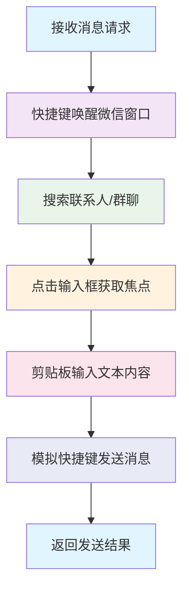

# 🔧 技术实现文档

**GitHub地址：https://github.com/xlight/wechat-sendmsg**

## 🏗️ 技术架构

### 核心实现原理
本项目采用**纯GUI自动化方案**，通过模拟用户操作实现微信消息发送，**绝无任何逆向工程或侵害行为**：



### MCP服务器 (mcp_server.py)
- 基于官方 MCP Python SDK (FastMCP) 实现
- 支持 stdio 和 Streamable HTTP 双传输模式
- Streamable HTTP 模式下与 HTTP API 共享同一 Starlette 应用和端口
- 使用 `@mcp.tool()` 装饰器注册工具
- CORS 中间件暴露 `Mcp-Session-Id` 响应头

### 微信控制器 (wechat_controller.py)

采用 **Mixin 模式**拆分为 4 个模块，降低单文件复杂度：

- **wechat_controller.py** - 主控制器入口，组合各 Mixin，提供 `send_text_message`、`schedule_message`、`get_status` 等公开 API
- **window_finder.py** - `WindowFinderMixin`：微信版本检测、窗口查找、快捷键激活（`_activate_window_by_hotkey`）、Win32 API 激活（`_activate_window`）、微信窗口判定（`_is_wechat_window`）、修饰键释放
- **tray_manager.py** - `TrayManagerMixin`：系统托盘图标查找（跨进程 TBBUTTON 结构读取）、双击恢复（PostMessage 回调）
- **gui_operations.py** - `GUIOperationsMixin`：输入框定位与点击、剪贴板输入与保护、联系人搜索、消息发送

**技术特性:**
- **NT 框架支持**: 完全支持微信 4.0 及以上版本
- **智能版本检测**: 通过进程信息自动检测微信版本
- **多窗口类型识别**: 支持 Qt 框架窗口类名模式匹配
- **系统托盘恢复**: 微信最小化到托盘时，通过跨进程内存读取定位托盘图标并模拟双击恢复
- **Edge 浏览器误识别防护**: 仅允许属于 WeChat 进程的窗口参与窗口匹配

#### 智能输入技术
- **智能定位**: 自适应不同窗口大小的输入框位置检测
- **剪贴板输入**: 使用Windows剪贴板API实现文本输入，完全避免输入法干扰
- **焦点验证**: 通过测试字符输入验证输入框焦点状态
- **剪贴板保护**: 自动备份和恢复用户原始剪贴板内容
- **多重发送**: 支持Enter、Ctrl+Enter、Alt+S等多种发送快捷键备选方案

#### 安全与合规性说明
- **无逆向工程**: 仅使用公开的Windows API和GUI自动化技术，不涉及微信内部数据结构分析
- **无内存读取**: 不读取微信进程内存或内部数据
- **无协议破解**: 不分析或破解微信通信协议
- **纯用户操作**: 所有操作均在用户界面层面模拟人工操作
- **隐私保护**: 所有消息处理均在本地完成，不经过任何第三方服务器

## 📊 功能特点技术细节

### 纯GUI自动化
- **全程模拟键盘快捷键和鼠标操作**，绝无任何逆向工程或侵害行为
- 仅使用公开的Windows API和GUI自动化技术，不涉及微信逆向工程或数据窃取

### MCP标准兼容
- 基于官方 MCP Python SDK (FastMCP) 实现，完全符合 MCP 2024-11-05 规范
- 支持 stdio 和 Streamable HTTP 双传输模式

### HTTP API
- 提供 RESTful API 接口，与 MCP 端点共享同一端口（Starlette 统一应用）

### 本地持久化消息队列
- SQLite 驱动的消息队列，支持优先级（0-10）、定时发送、自动重试、崩溃恢复
- **双发送模式**: 队列模式（异步入队，后台 worker 消费）和同步模式（暂停队列，立即执行）
- **队列管理**: 通过 MCP 工具和 HTTP API 查看状态、取消待发送、重试失败消息
- **Web 管理界面**: `/queue` 页面可视化管理队列（筛选、分页、自动刷新）

### NT 框架支持
- 完全支持微信 4.0 以上的 NT 框架版本
- 智能版本检测：自动检测微信版本并适配相应的操作方式

### 窗口管理技术
- **快捷键窗口激活**: 优先通过全局快捷键激活微信窗口（需在微信设置中配置），失败时自动回退到 Win32 API
- **系统托盘恢复**: 微信最小化到托盘时自动恢复窗口

### 输入技术
- **剪贴板输入技术**: 使用剪贴板输入，完全避免输入法状态影响
- **多种发送方式**: 支持Enter、Ctrl+Enter、Alt+S等多种发送快捷键

### 系统架构
- **异步处理**: 异步处理，不阻塞 AI 助手或调用方
- **完整日志**: 完整的错误处理和日志记录
- **系统托盘模式**: 支持以系统托盘应用运行，后台启动 HTTP 服务，右键菜单管理
- **Nuitka 编译打包**: 支持编译为独立 `.exe` 可执行文件，无需 Python 环境

### 防封号保护系统
- **增强版速率限制**: 分钟/小时/天三级限制
- **人类行为模拟**: 随机思考时间、打字速度
- **工作时间控制**: 仅在指定时段和日期运行
- **内容多样化**: 智能添加前缀/后缀、随机跳过
- **自然 GUI 操作**: 随机鼠标偏移、缓慢移动

## 🔒 技术合规性声明

**重要声明：本项目采用纯GUI自动化技术，绝无任何逆向工程或侵害行为**

1. **纯用户操作模拟**: 本项目仅通过模拟键盘快捷键和鼠标点击操作微信，与人工操作完全一致
2. **无逆向工程**: 不涉及微信客户端逆向、内存读取、协议分析等任何逆向工程行为
3. **无数据窃取**: 不读取微信聊天记录、联系人信息、登录凭证等任何用户数据
4. **无协议破解**: 不分析或破解微信通信协议，所有操作均在用户界面层面完成
5. **隐私保护**: 所有消息处理均在本地完成，不经过任何第三方服务器
6. **技术合规**: 仅使用公开的Windows API和GUI自动化技术，符合技术研究规范

## 📁 项目结构技术说明

```
WeChat-SendMsg/
├── 📂 src/
│   ├── 📄 __init__.py               # 包初始化
│   ├── 📄 mcp_server.py             # MCP 服务器 + HTTP API（FastMCP + Starlette 统一应用）
│   ├── 📄 wechat_controller.py      # 微信自动化控制器（主入口）
│   ├── 📄 window_finder.py          # 窗口查找与版本检测 Mixin
│   ├── 📄 tray_manager.py           # 系统托盘管理 Mixin
│   ├── 📄 gui_operations.py         # GUI 操作（输入、搜索、发送）Mixin
│   ├── 📄 config.py                 # 配置管理模块
│   ├── 📄 message_queue.py          # 消息队列 + 后台 Worker（SQLite 持久化）
│   ├── 📄 paths.py                  # 路径工具模块（兼容源码/编译模式）
│   ├── 📄 systray_app.py            # 系统托盘应用模块（pystray + 后台 uvicorn）
│   └── 📂 anti_ban/                 # 防封号保护系统
│       ├── 📄 __init__.py           # 防封号包初始化
│       ├── 📄 enhanced_rate_limiter.py    # 增强版速率限制器
│       ├── 📄 human_behavior.py     # 人类行为模拟器
│       ├── 📄 work_time_controller.py     # 工作时间控制器
│       ├── 📄 content_diversifier.py      # 内容多样化器
│       └── 📄 natural_gui.py        # 自然 GUI 操作
├── 📂 examples/
│   └── 📄 mcp_client_example.py     # MCP 客户端使用示例（支持 stdio / streamable-http）
├── 📂 docs/
│   ├── 📄 QUICK_START.md            # 快速开始指南
│   └── 📄 AVOID_BAN.md              # 防封号指南
├── 📂 static/
│   ├── 📄 index.html                # Web 首页
│   ├── 📄 test.html                 # 测试页面
│   └── 📄 queue.html                # 队列管理页面
├── 📂 data/
│   ├── 📄 config.json                # 配置文件（运行时自动生成）
│   ├── 📄 config.conservative.json   # 保守模式配置模板
│   ├── 📄 config.moderate.json       # 中等模式配置模板
│   ├── 📄 config.aggressive.json     # 激进模式配置模板
│   └── 📄 messages.db               # 消息队列数据库（运行时自动生成）
├── 📂 assets/
│   └── 📄 icon.ico                  # 应用图标（托盘图标 + 编译 exe 图标）
├── 📄 build.py                      # Nuitka 编译构建脚本
├── 📄 requirements.txt              # 依赖包列表
├── 📄 LICENSE                       # 许可证文件
└── 📄 README.md                     # 项目说明文档
```

## ⚙️ 配置文件技术参数

### HTTP 服务器配置
- `http_port`: HTTP 服务器端口号
- `queue_db_path`: 消息队列数据库路径
- `queue_max_retries`: 消息最大重试次数
- `queue_poll_interval`: 队列轮询间隔（秒）

### 防封号保护配置
- `rate_limit_per_minute`: 每分钟消息发送限制
- `rate_limit_per_hour`: 每小时消息发送限制
- `rate_limit_per_day`: 每天消息发送限制
- `min_think_time`: 最小思考时间（秒）
- `max_think_time`: 最大思考时间（秒）

### 工作时间控制
- `work_hours_start`: 工作开始时间（小时）
- `work_hours_end`: 工作结束时间（小时）
- `work_days`: 工作日列表（0-6，0=周日）
- `max_daily_runtime_hours`: 最大每日运行时间（小时）

### 微信快捷键配置
- `wechat_hotkey`: 微信激活快捷键（如 "ctrl+alt+w"）

## 🔧 开发与扩展

### 添加新工具
1. 在 `mcp_server.py` 中使用 `@mcp.tool()` 装饰器注册新工具
2. 在 `wechat_controller.py` 中实现对应的功能方法
3. 更新文档说明新工具的使用方法

### 支持其他平台
- **macOS**: 需要适配 macOS 的窗口管理 API
- **Linux**: 需要适配 Linux 的窗口管理 API
- **移动端**: 需要完全不同的技术方案

### 后续开发计划
- 支持图片、视频等多媒体消息发送
- 增强错误处理和恢复机制
- 优化性能和使用体验
- 增加更多自动化功能

---

*本文档详细说明了项目的技术实现细节，适用于开发者和技术爱好者参考。普通用户请参考 README.md 获取简单易懂的使用指南。*

**GitHub地址：https://github.com/xlight/wechat-sendmsg**
